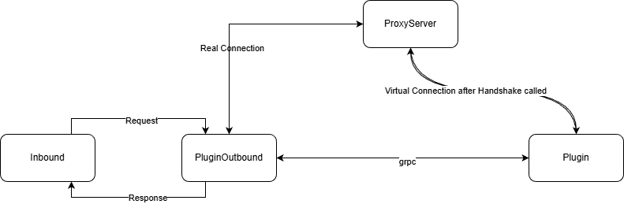

# Wv2ray-plugin-template

[English](./README.md)

本仓库为 wv2ray 插件的模板。

该插件基于 [go-plugin](https://github.com/hashicorp/go-plugin) 并使用 [gRPC](https://grpc.io/)，因此插件可以用任何支持 gRPC 的语言实现。本仓库是用 Go 编写的示例模板。

## 架构

当有代理请求到来时，入口（inbound）服务器会处理该请求并将其转发到出口（outbound）服务器。如果请求使用的协议在 xray 中不被支持，则由插件的出口服务器处理该请求。

在插件出口服务器中，处理器会根据协议、地址、端口及其它参数与代理服务器建立连接。连接建立后，插件出口服务器会通过 gRPC 调用 `CreateHandler` 与 `Handshake` 方法，创建处理器并与代理服务器完成握手。

握手完成后，插件出口服务器会调用 `Process` gRPC 方法来处理请求。在处理期间，握手对应的流（Handshake stream）不应关闭，以便在插件与代理服务器之间转发数据（图中所示的虚拟连接）。

当 `Process` 方法返回后，插件出口服务器会关闭所有流并调用 `Shutdown` 方法。
